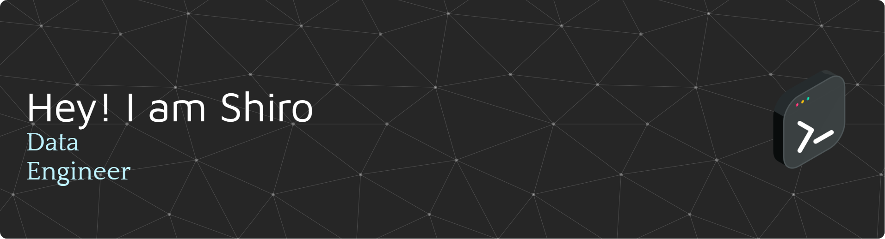

###

  
  
  
  

###

<h1 align="center">hey there 👋</h1>

###

<h3 align="left">👩‍💻  About Me</h3>

###

I'm Shiro from VIệt Nam  - 👋 Hi, I’m @shiroNaux - 👀 I’m interested in some thing like you 💖💖💖 - 🌱 I’m currently learning almost I can 😑😑 - 💞️ I’m looking to collaborate on what ever I can 🙄 - 📫 How to reach me 😒😩 if you want, you'll know

###

<h3 align="left">🛠 Language and tools</h3>

###

  
  
  
  
  
  
  
  
  
  
  
  
  
  
  
  
  
  
  
  
  
  
  
  
  
  
  

###

<h3 align="left">🔥   My Stats :</h3>

###

  

###

###

<!---
shiroNaux/shiroNaux is a ✨ special ✨ repository because its `README.md` (this file) appears on your GitHub profile.
You can click the Preview link to take a look at your changes.
--->

